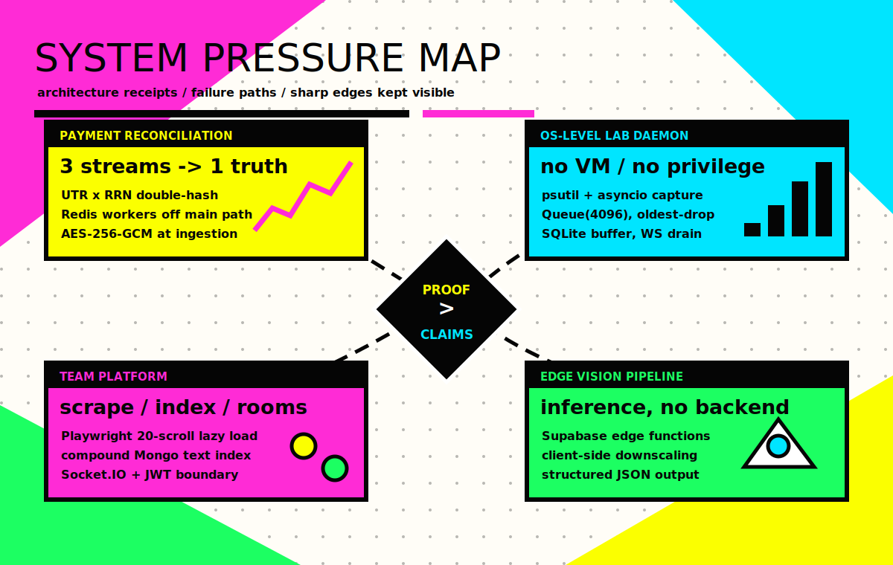
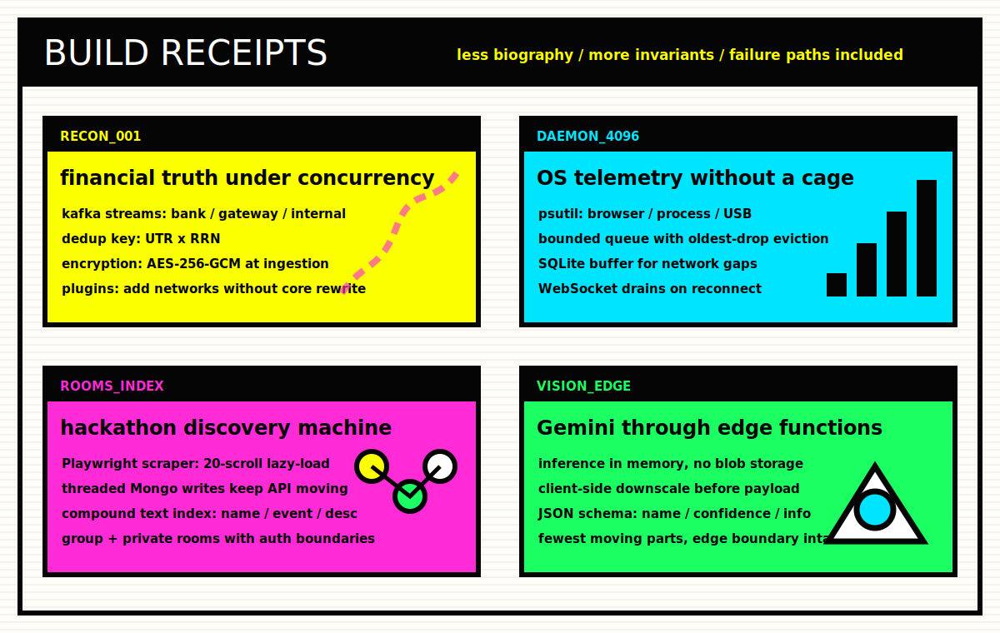

<!-- PROFILE_ARTIFACT: VOLTAGE_INDEX / NO_TEMPLATE_DNA -->

<p align="center">
  
</p>

<table width="100%" border="0" cellspacing="0" cellpadding="0">
  <tr>
    <td width="63%" valign="top">
      
    </td>
    <td width="37%" valign="top">
      
    </td>
  </tr>
</table>

<p align="center">
  
</p>

```ts
const shipped_under_pressure = [
  {
    surface: "financial reconciliation",
    invariant: "3 event streams collapse into 1 deterministic ledger",
    machinery: ["Kafka", "Redis pub/sub", "AES-256-GCM", "UTR x RRN hash", "plug-in comparators"],
  },
  {
    surface: "OS telemetry daemon",
    invariant: "capture survives network drops without privileged access",
    machinery: ["psutil", "asyncio.Queue(4096)", "SQLite buffer", "WebSocket drain"],
  },
  {
    surface: "hackathon team platform",
    invariant: "scraped discovery, indexed search, realtime rooms, auth boundaries",
    machinery: ["Playwright", "ThreadPoolExecutor", "Mongo text index", "Socket.IO", "JWT"],
  },
  {
    surface: "edge vision pipeline",
    invariant: "inference runs through edge functions without blob storage",
    machinery: ["Supabase", "Gemini Vision", "client downscale", "structured JSON"],
  },
] as const;
```

<table width="100%" border="0" cellspacing="0" cellpadding="0">
  <tr>
    <td align="center"><a href="https://github.com/soham-patil-05"><code>github://soham-patil-05</code></a></td>
    <td align="center"><a href="https://leetcode.com/u/sompatil2005/"><code>leetcode://knight-1923</code></a></td>
    <td align="center"><a href="https://www.linkedin.com/in/soham-patil-27a9b2287"><code>signal://linkedin</code></a></td>
  </tr>
</table>
