<!--
  SOHAM PATIL — GITHUB PROFILE README
  Design language: Systems Observability Terminal
  All SVGs are self-contained. No external image deps except GitHub Stats cards and snake.
-->

<div align="center">

<!-- ═══════════════════════════════════════════════════════════════
     HERO BANNER — SVG animated terminal header
═══════════════════════════════════════════════════════════════ -->

<picture>
  <source media="(prefers-color-scheme: dark)" srcset="https://capsule-render.vercel.app/api?type=waving&color=0D1117&height=0">
</picture>



</div>

---

<!-- ═══════════════════════════════════════════════════════════════
     SYSTEM IDENTITY BLOCK
═══════════════════════════════════════════════════════════════ -->

<div align="center">

```
┌─────────────────────────────────────────────────────────────────┐
│  PROCESS     soham-patil                                        │
│  ROLE        SDE Intern candidate · AI & Systems Engineering    │
│  INSTITUTION Pune Institute of Computer Technology  [9.14 GPA]  │
│  STATUS      ████████████████████░░░░  B.E. IT — Year 2 of 4   │
│  SIGNAL      building at the intersection of AI + infrastructure│
└─────────────────────────────────────────────────────────────────┘
```

</div>

---

<!-- ═══════════════════════════════════════════════════════════════
     TELEMETRY STRIP — LIVE STATS
═══════════════════════════════════════════════════════════════ -->

<div align="center">

<table border="0" cellspacing="0" cellpadding="0">
<tr>
<td width="50%" align="center">


</td>
<td width="50%" align="center">


</td>
</tr>
</table>

</div>

---

<!-- ═══════════════════════════════════════════════════════════════
     SYSTEMS MAP — WHAT I BUILD
═══════════════════════════════════════════════════════════════ -->

<details open>
<summary><b>› SYSTEM ARCHITECTURE MAP</b> &nbsp;— what I actually build</summary>

<br>

```
                          ┌─ INGESTION LAYER ──────────────────────┐
                          │                                        │
  [LOG STREAMS] ──────── Kafka Topic ──── Orchestrator Daemon      │
  [METRICS]     ──────── Thresholds ──── Rule Engine               │
  [EVENTS]      ──────── ZooKeeper  ──── State Coordinator         │
                          └────────────────────┬───────────────────┘
                                               │ anomaly detected
                          ┌─ REASONING LAYER ──▼───────────────────┐
                          │                                        │
                          │  Gemini LLM ── ReAct Agent Loop        │
                          │    step 1: observe → tool_call         │
                          │    step 2: reason  → next_action       │
                          │    step N: [max 8] → remediation plan  │
                          │                                        │
                          └────────────────────┬───────────────────┘
                                               │ decision made
                          ┌─ RECOVERY LAYER ───▼───────────────────┐
                          │                                        │
                          │  Docker Socket ── restart / rollback   │
                          │  Redis Pub/Sub ── async worker pool    │
                          │  WebSocket     ── real-time telemetry  │
                          │  AES-256-GCM   ── encrypted audit log  │
                          │                                        │
                          └────────────────────────────────────────┘
```

> This is not pseudocode. This is the actual architecture of projects I've shipped.

</details>

---

<!-- ═══════════════════════════════════════════════════════════════
     PROJECT DOSSIER — 5 key projects as incident reports
═══════════════════════════════════════════════════════════════ -->

<details open>
<summary><b>› PROJECT DOSSIER</b> &nbsp;— incident-driven engineering log</summary>

<br>

### `[P-001]` Autonomous Self-Healing Microservices — AI SRE Engine


> **Problem:** Distributed systems fail silently. Humans react too slowly.
> **Solution:** A closed-loop AI agent that ingests Kafka telemetry, reasons with a Gemini ReAct loop (8-step hard cap), and auto-executes Docker recovery ops.
> **Outcome:** Zero-touch remediation across LATENCY / ERROR / CRASH fault modes.

```
FAULT_DETECTED → AGENT_INVOKED → [reason→act×N] → RECOVERY_EXECUTED → INCIDENT_CLOSED
```

🔗 [Live Demo](https://self-healing-microservices-ai.vercel.app/) &nbsp;|&nbsp; [Source](https://github.com/soham-patil-05/self-healing-microservices)

---

### `[P-002]` TechFiesta — Real-Time Financial Reconciliation Engine


> **Problem:** BANK_CBS ↔ PAYMENT_GATEWAY ↔ UPI_NETWORK produce concurrent high-frequency transaction logs. Duplicates corrupt settlement.
> **Solution:** Kafka ingestion + double-hash deduplication (UTR×RRN composite key) + Redis async worker pool. AES-256-GCM at ingestion boundary.
> **Outcome:** Plug-in comparator architecture. New payment networks = zero core changes.

---

### `[P-003]` Hack of Clans — Hackathon Team-Matching Ecosystem


> 3-component ecosystem (React + Express + FastAPI scraper). Headless Playwright scraper with 20-scroll lazy-load, ThreadPoolExecutor-backed non-blocking PyMongo writes. Compound MongoDB text index for instant search. JWT + bcrypt + Google OAuth.

🔗 [Live Demo](https://vercel.com/soham-patils-projects-c6a065dc/hack-of-clans-frontend)

---

### `[P-004]` LabGuardian — OS-Level Lab Monitoring Daemon


> Python daemon capturing browser history, active processes, USB interrupts at sub-10s latency. asyncio.Queue(maxsize=4096) with oldest-drop eviction. Offline-first SQLite buffer with reconnect-on-restore WebSocket bridge.

🔗 [Live Demo](https://labguardian.vercel.app/)

---

### `[P-005]` AI Object Identifier — Edge Inference Pipeline


> Gemini Vision API served via Supabase Edge Functions. Base64 in-memory processing — no blob storage. Client-side downscaling before encode. Structured JSON output: objectName · confidence · description · additionalInfo.

🔗 [Live Demo](https://object-identification-3.onrender.com/)

</details>

---

<!-- ═══════════════════════════════════════════════════════════════
     STACK REGISTRY — clean, no badge spam
═══════════════════════════════════════════════════════════════ -->

<details>
<summary><b>› STACK REGISTRY</b> &nbsp;— everything I've shipped with</summary>

<br>

| Layer | Technologies |
|:------|:-------------|
| **Languages** | Python · JavaScript · TypeScript · C++ · SQL |
| **Runtime & Frameworks** | Node.js · Express.js · FastAPI · React · Socket.io |
| **AI & Agents** | Gemini API (Text + Vision) · ReAct Agent Pattern · LLM Tool-Calling |
| **Messaging & Stream** | Apache Kafka · ZooKeeper · Redis Pub/Sub |
| **Async & Systems** | asyncio · psutil · ThreadPoolExecutor · WebSockets |
| **Databases** | MongoDB · Redis Cache · SQLite · Mongoose |
| **Infrastructure** | Docker · Vercel · Supabase · Cloudinary · AES-256-GCM |
| **Security & Auth** | JWT · bcryptjs · Google OAuth2 |
| **Scraping & Automation** | Playwright · Headless Chromium |

</details>

---

<!-- ═══════════════════════════════════════════════════════════════
     COMPETITIVE PROGRAMMING — operator metrics
═══════════════════════════════════════════════════════════════ -->

<details>
<summary><b>› OPERATOR METRICS</b> &nbsp;— competitive programming signal</summary>

<br>

```
┌──────────────────────────────────────────────────────────────────┐
│  PLATFORM          RANK / RATING        PROBLEMS               │
├──────────────────────────────────────────────────────────────────┤
│  LeetCode          Knight  ·  1923      600+ solved            │
│  CodeChef          3-Star  ·  1638      active                 │
│  Codeforces        Pupil   ·  1380      active                 │
│  GeeksforGeeks     —                   contributed             │
└──────────────────────────────────────────────────────────────────┘
```

[](https://leetcode.com/u/sompatil2005/)
[](https://www.codechef.com/)
[](https://codeforces.com/)

</details>

---

<!-- ═══════════════════════════════════════════════════════════════
     CONTRIBUTION SNAKE ANIMATION
═══════════════════════════════════════════════════════════════ -->

<div align="center">

**CONTRIBUTION TRACE**

<picture>
  <source media="(prefers-color-scheme: dark)" srcset="https://raw.githubusercontent.com/soham-patil-05/soham-patil-05/output/github-contribution-grid-snake-dark.svg">
  <source media="(prefers-color-scheme: light)" srcset="https://raw.githubusercontent.com/soham-patil-05/soham-patil-05/output/github-contribution-grid-snake.svg">
  
</picture>

</div>

---

<!-- ═══════════════════════════════════════════════════════════════
     MOST USED LANGUAGES
═══════════════════════════════════════════════════════════════ -->

<div align="center">


</div>

---

<!-- ═══════════════════════════════════════════════════════════════
     FOOTER — signal line
═══════════════════════════════════════════════════════════════ -->

<div align="center">

<br>

```
╔══════════════════════════════════════════════════════════╗
║  I build systems that observe themselves and recover.    ║
║  I write agents that reason and act.                     ║
║  I ship end-to-end.                                      ║
╚══════════════════════════════════════════════════════════╝
```

<br>

[](https://www.linkedin.com/in/soham-patil-27a9b2287)
&nbsp;
[](mailto:sompatil2005@gmail.com)
&nbsp;
[](https://leetcode.com/u/sompatil2005/)

<br>

<sub>last compiled · auto-updated daily via GitHub Actions</sub>

</div>
