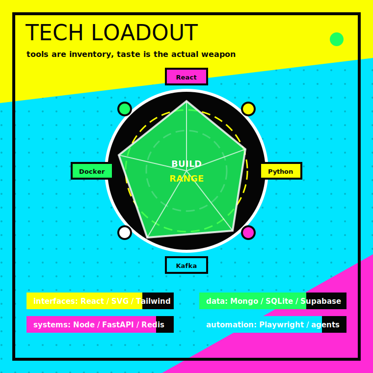
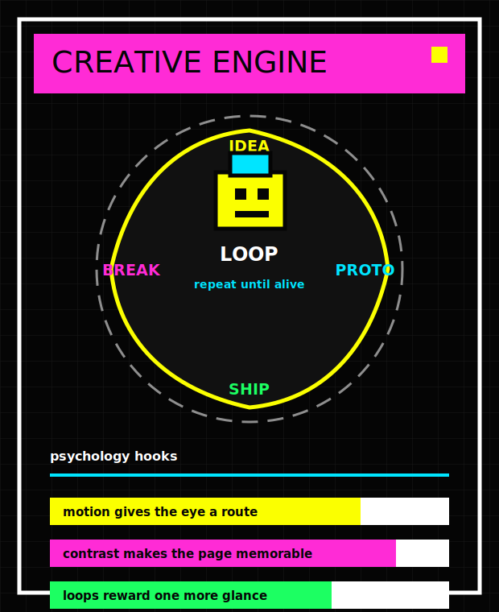
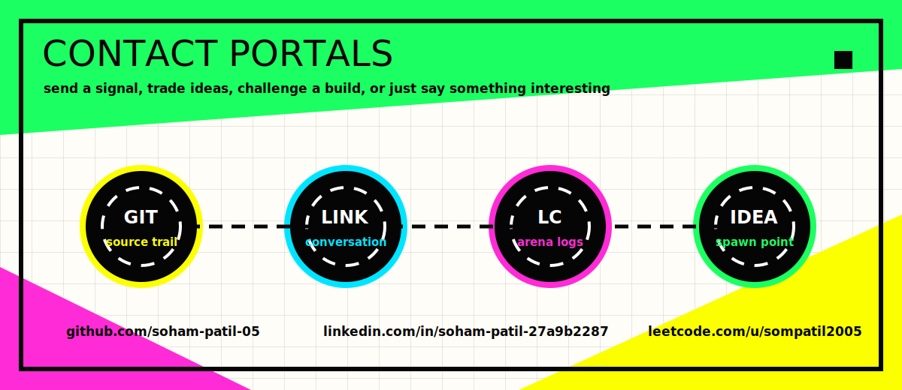

<!-- PROFILE_ARTIFACT: ARCADE_RUNTIME / ANIMATED_SVG_ONLY -->

<p align="center">
  
</p>

<table width="100%" border="0" cellspacing="0" cellpadding="0">
  <tr>
    <td width="56%" valign="top">
      
    </td>
    <td width="44%" valign="top">
      
    </td>
  </tr>
</table>

<p align="center">
  
</p>

```ts
const arcade_runtime = {
  player: "soham-patil-05",
  mode: "build_first",
  vibe: ["bright", "restless", "experimental", "systems-minded"],
  loops: ["imagine", "prototype", "instrument", "break", "tighten", "ship"],
  tools: {
    languages: ["TypeScript", "Python", "JavaScript", "C++", "SQL"],
    interfaces: ["React", "Tailwind", "SVG", "Canvas-minded UI"],
    systems: ["Node", "FastAPI", "Kafka", "Redis", "Docker", "WebSockets"],
    data: ["MongoDB", "SQLite", "Supabase", "structured JSON"],
    automation: ["Playwright", "asyncio", "agents", "edge functions"],
  },
  rule: "make it work, make it weird, make it useful",
} as const;
```

<table width="100%" border="0" cellspacing="0" cellpadding="0">
  <tr>
    <td align="center"><a href="https://github.com/soham-patil-05"><code>github://soham-patil-05</code></a></td>
    <td align="center"><a href="https://www.linkedin.com/in/soham-patil-27a9b2287"><code>contact://linkedin</code></a></td>
    <td align="center"><a href="https://leetcode.com/u/sompatil2005/"><code>arena://leetcode</code></a></td>
  </tr>
</table>
