  

## About

I like building software, solving challenging problems, and learning something new  continuously. Currently pursuing a B.E. in Information Technology

## Skills

**Languages:** C++, Java, Python, JavaScript
**Web Development:** Node.js, Express.js, React.js, RESTful APIs, Socket.IO, WebSockets, Tailwind CSS, Vite
**Frontend & State Management:** React 19, Zustand, Tkinter
**Databases:** MySQL, MongoDB, PostgreSQL, SQLite
**Tools & Platforms:** Git, GitHub, Docker, Docker Compose, VS Code, PyCharm
**APIs & Integrations:** Anthropic Claude API, Google OAuth, asyncio
**Core Concepts:** Data Structures & Algorithms, Object-Oriented Programming, Database Management Systems

## Achievements

- Solved overall 800+ data structures and algorithms problems across LeetCode ,GeeksforGeeks and Codeforces covering arrays, graphs, dynamic programming, and system design.
- Knight on Leetcode.
- 3 stars on Codechef.

## Projects

<table width="100%" border="0" cellspacing="0" cellpadding="0">
  <tr>
    <td width="33%" valign="top">

### LabGuardian

Real-time student monitoring desktop app with concurrent async monitors for USB, browser, process, and network activity, backed by a fault-tolerant SQLite persistence layer.

`Python` · `Tkinter` · `SQLite` · `asyncio` · `REST APIs`

[Repository](https://github.com/soham-patil-05/labguardian)

  </td>
  <td width="33%" valign="top">

### Self-Healing Microservices Platform

AI-powered orchestration system that classifies service failures and prescribes recovery actions, with a dual-mode (suggest/auto) recovery engine built on the Docker API.

`Node.js` · `Docker` · `Claude API` · `React` · `WebSockets`

[Repository](https://github.com/soham-patil-05/self-healing-microservices)

  </td>
  <td width="33%" valign="top">

### Hack of Clans

Full-stack hackathon collaboration platform for discovering events, forming teams, and chatting in real time, with Google OAuth authentication.

`React 19` · `Node.js` · `Socket.IO` · `Zustand` · `MongoDB`

[Repository](https://github.com/soham-patil-05/hack-of-clans)

  </td>
  </tr>
</table>

## Competitive Programming

| Platform | Profile |
|---|---|
| LeetCode | [leetcode.com/u/sompatil2005](https://leetcode.com/u/sompatil2005/) |
| Codeforces | [codeforces.com/profile/Soham_Patil_](https://codeforces.com/profile/Soham_Patil_) |
| CodeChef | [codechef.com/users/soham_2005](https://www.codechef.com/users/soham_2005) |
| HackerRank | [hackerrank.com/profile/sompatil2005](https://www.hackerrank.com/profile/sompatil2005) |

## Contact

